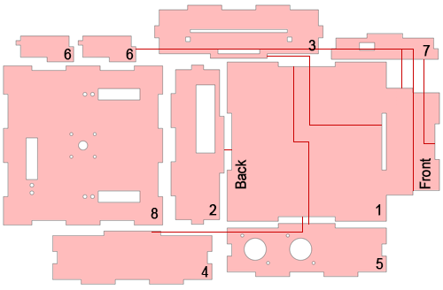
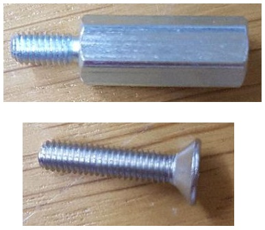
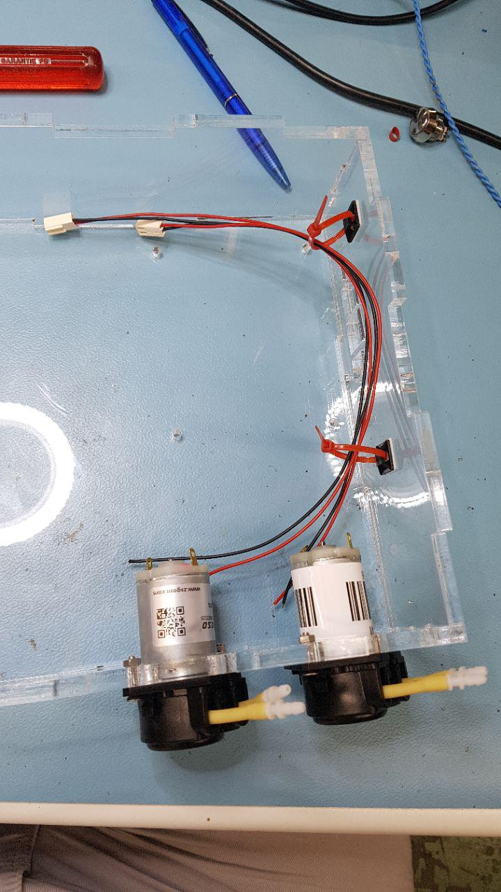
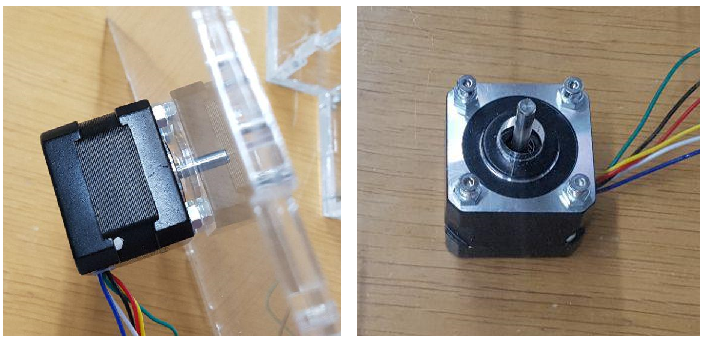
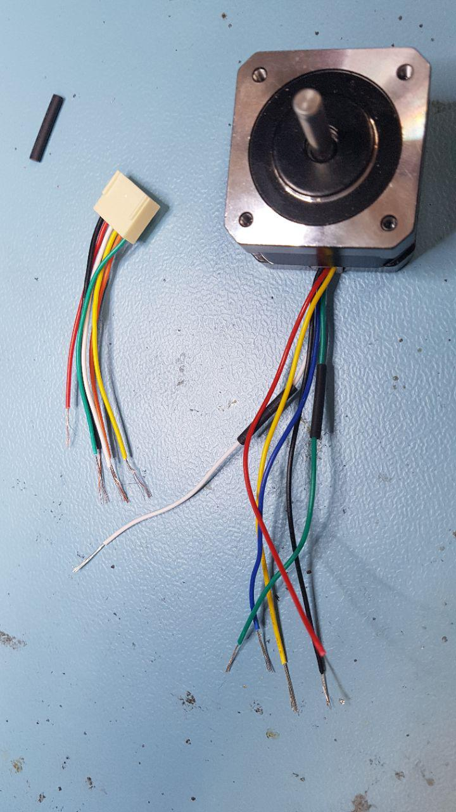
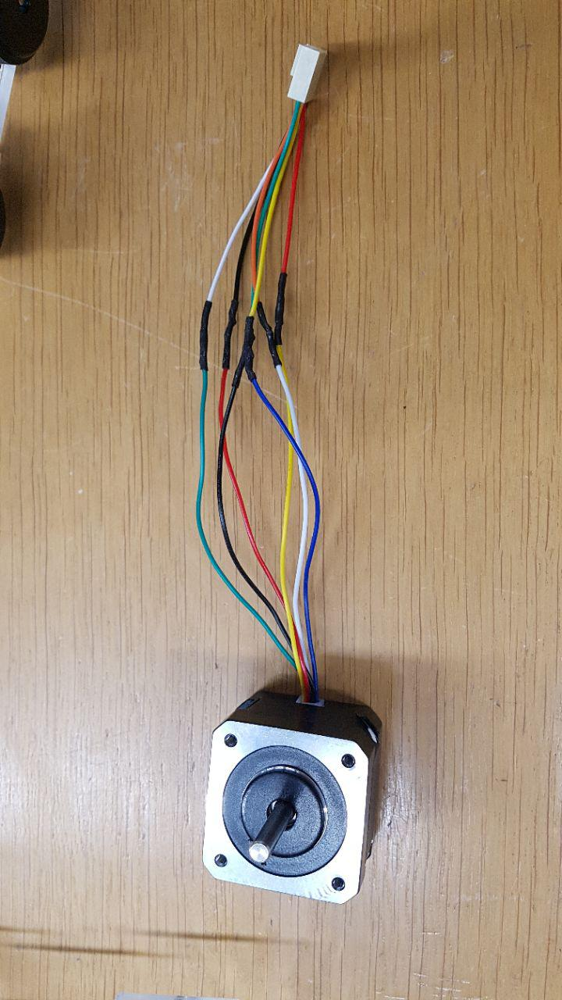
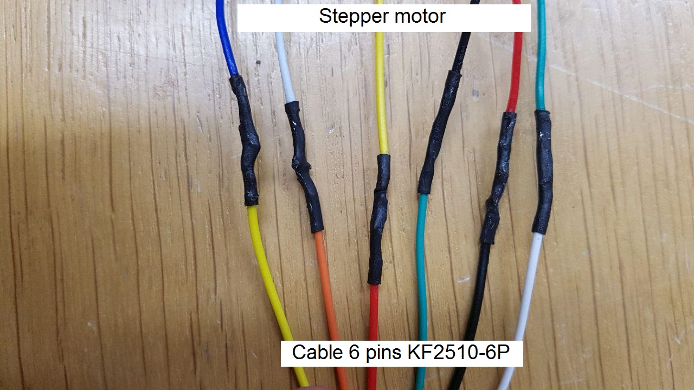

# Assembling the bioreactor

## Introduction

This manual describes how to assemble a functionnal bioreactor once the PCB plate has been readied and the pieces for the casing have been laser cutted.

The bioreactor is composed of three distinct layers, as can be seen on the following image:

1. **The base:** It is the piece on which the bioreactor stands. It contains the main PCB, as well as the peristaltic pumps and the LCD screen.
2. **The heating plate:** Placed on top of the base, it heats the recipient in which are placed our materials of interest.
3. **The recipient:** It contains the solution in which will be placed our cultures and materials of interest.

## Material required for reactor assembly

**[To be completed]**

## Assembling the casing

The first step to assemble the bioreactor is to put the casing together. In this part, we will discuss the base only. Explanation on how to assemble the heating plate will come in a [dedicated section](#readying-the-heating-cell).

First, identify the parts you are dealing with. In the following image are shown all the parts required do build the base, numbered from 1 to 7. The red lines show how the different parts connect.

Tape all parts together **except for the lid** and glue them with *dichloromethane*. Wait about 10 minutes until the solvent has dried out. When assembling, please beware of the following details:
* On the bottom part, the small holes designed for the screws that will support the PCB and the LCD should be on the left when looking from the front of the reactor.
* The part containing the two big circular holes for the pumps should be on the right side when looking from the front and the holes should be in the back
* On both the back part and the small front part, the holes should be on the left when facing the bioreactor.

The result should look like this:

Once this is done, screw the support-screws for the LCD screen and the PCB-plate with 2 times 4 *M3x14mm screws* attached to 2 times 4 *M3x14mm fasteners*.

The screws before assembly:

How it should look:

## Inserting the peristaltic pumps

After finishing the assembly of the base, it is time to start adding the important parts. Take two *peristaltic pumps* and insert them in the holes made for them in the right wall of the base.
Screw them with 2 *M3x14cm screws* each as shown on the following picture.

Take two *cables 2 pins KF2510-2P* and solder them to the pumps as follows:

This completes the assembling of the bases body. We will now work on the bases lid (top part).

## Adding the stepper

First, we will fixate the stepper motor that will control the agitation.

Take the base top part and insert the *stepper motor* in the middle. Fixate it with four *M3x14mm* screws. Place four *M4 bolts* between the lid and the motor to create some space between them.

Take one *cable 6 pins KF2510-6P* and solder it to the stepper motor as shown in the following pictures:

*The stepper motor and the cable before soldering*

*The stepper motor and the cable after soldering*

*Detail of the connexions between the stepper motor and the cable*

When the cable is properly soldered, place the magnets on the stepper motor as follows:

**[To be completed]**

## Adding the loading cells

**[To be completed]**

## Preparing the heating cell

**[To be completed]**
