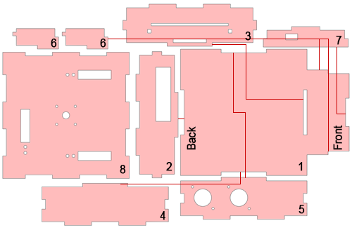
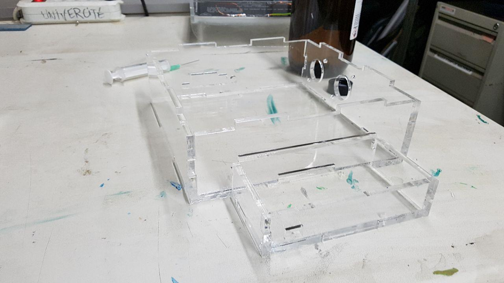
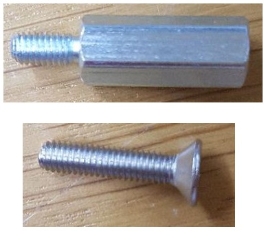
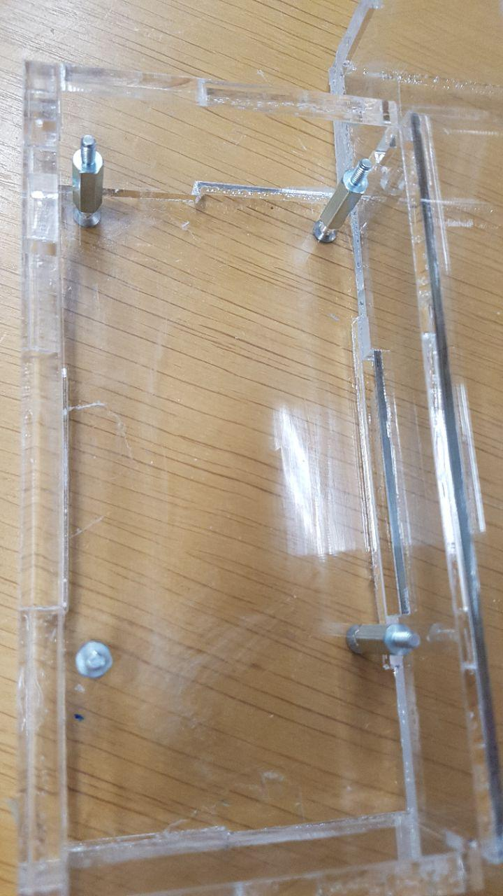

# Assembling the casing of the base

[Back to index](../../index.md)
[Previous section](../pinMapping.md)

---

The bioreactor is composed of three distinct layers, as can be seen on the following image:

1. **The base:** It is the piece on which the bioreactor stands. It contains the main PCB, as well as the peristaltic pumps and the LCD screen.
2. **The heating plate:** Placed on top of the base, it heats the recipient in which are placed our materials of interest.
3. **The recipient:** It contains the solution in which will be placed our cultures and materials of interest.

In this section, we will cover the assembly of the base. Assembly of the heating plate is treated in the [corresponding section](../pid).

First, identify the parts you are dealing with. In the following image are shown all the parts required do build the base, numbered from 1 to 7. The red lines show how the different parts connect.

Tape all parts together **except for the lid** and glue them with *dichloromethane*. Wait about 10 minutes until the solvent has dried out. When assembling, please beware of the following details:
* On the bottom part, the small holes designed for the screws that will support the PCB and the LCD should be on the left when looking from the front of the reactor.
* The part containing the two big circular holes for the pumps should be on the right side when looking from the front and the holes should be in the back
* On both the back part and the small front part, the holes should be on the left when facing the bioreactor.

The result should look like this:

Once this is done, screw the support-screws for the LCD screen and the PCB-plate with 2 times 4 *M3x14mm screws* attached to 2 times 4 *M3x14mm fasteners*.

The screws before assembly:

How it should look:

[Next section](../pumps)