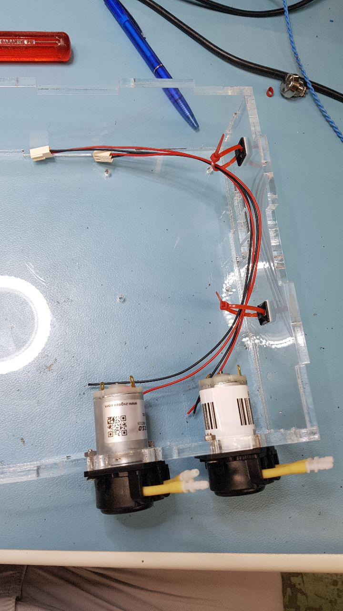
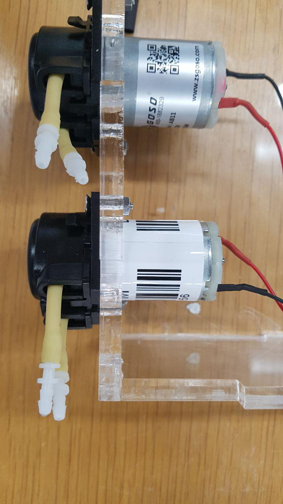

# Inserting the peristaltic pumps

[Back to index](../../index.md)
[Previous section](../base)

---

After finishing the assembly of the base, it is time to start adding the important parts. Take two *peristaltic pumps* and insert them in the holes made for them in the right wall of the base.
Screw them with 2 *M3x14cm screws* each as shown on the following picture.

Take two *cables 2 pins KF2510-2P* and solder them to the pumps as follows:

This completes the assembling of the bases body. We will now work on the bases lid (top part).

[Next section](../stepper)