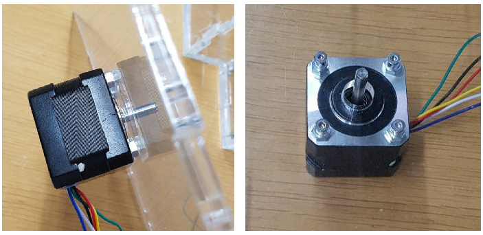
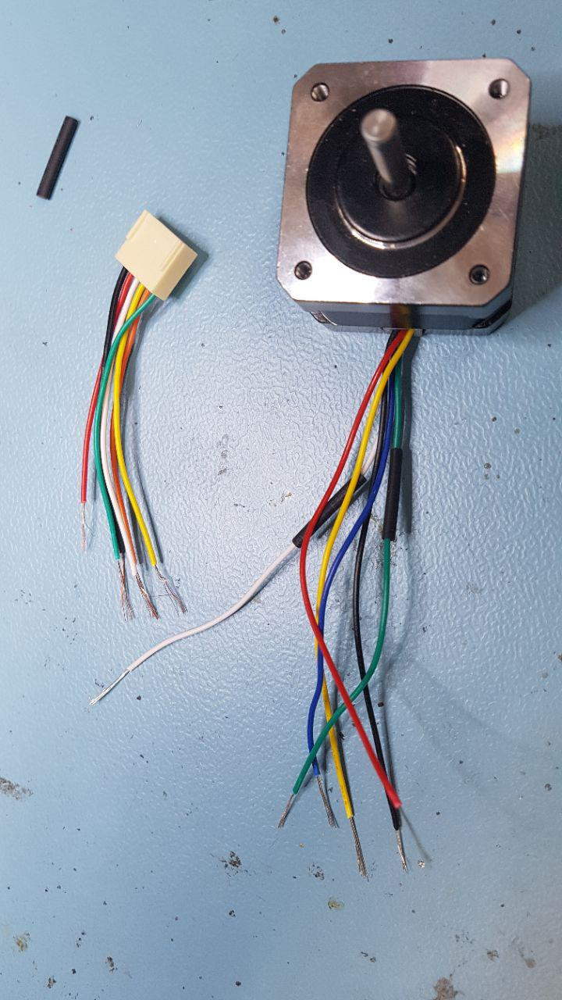
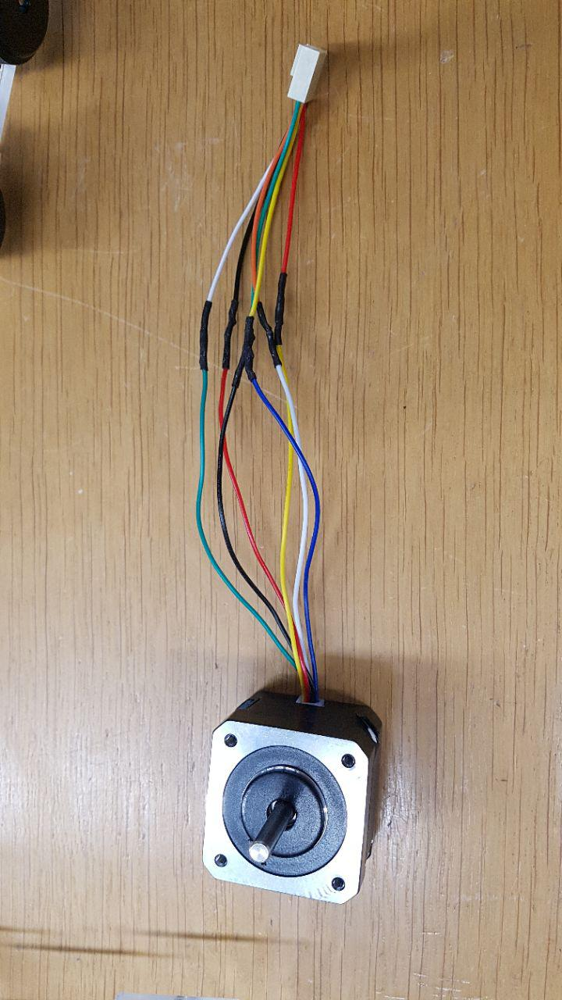
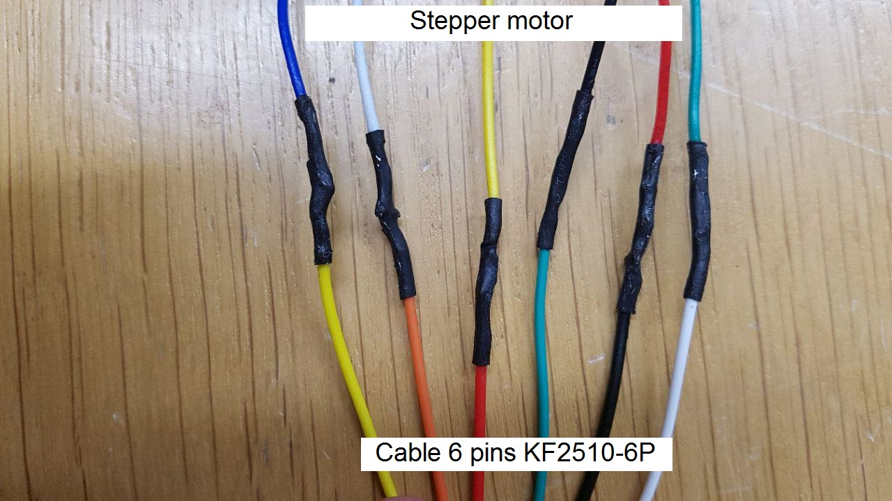
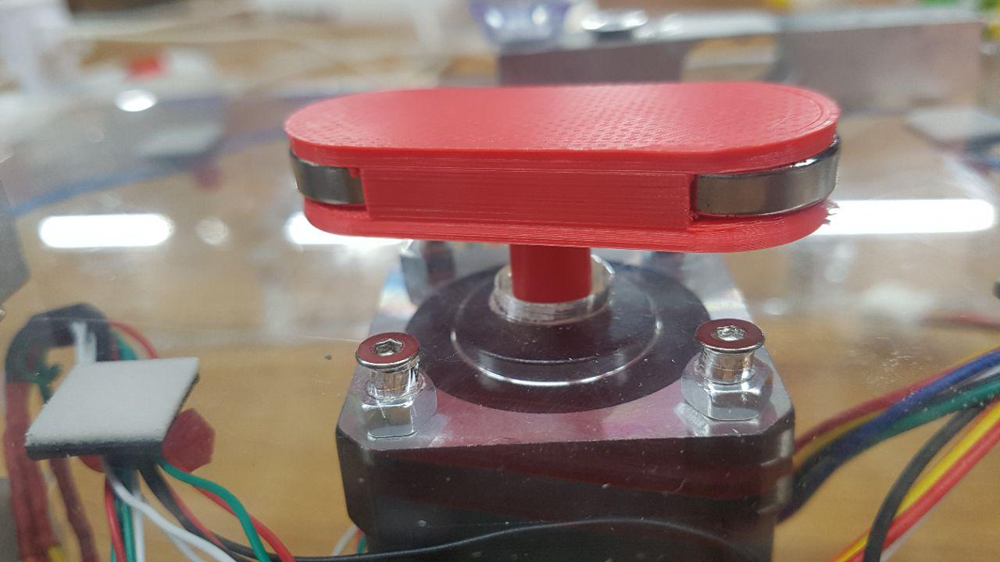

# Adding the stepper motor

[Back to index](../../index.md)
[Previous section](../pumps)

---

**/!\ This version of the stepper motor assembly is compatible with v4.4 of the bioreactor and not v4.5 or more /!\\**

First, we will fixate the stepper motor that will control the agitation.

Take the base top part and insert the *stepper motor* in the middle. Fixate it with four *M3x14mm* screws. Place four *M4 bolts* between the lid and the motor to create some space between them.

Take one *cable 6 pins KF2510-6P* and solder it to the stepper motor as shown in the following pictures:

*The stepper motor and the cable before soldering*

*The stepper motor and the cable after soldering*

*Detail of the connexions between the stepper motor and the cable*

When the cable is properly soldered, place the magnets on the stepper motor as follows:

Take the *3D-printed part* and glue *two magnets* in the corresponding slots with a *hot glue pistol*.

Then, insert the obtained piece on the top of the stepper motor as shown in the picture:

[Next section](../weight)