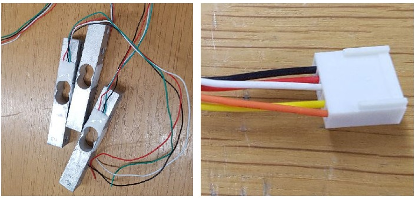
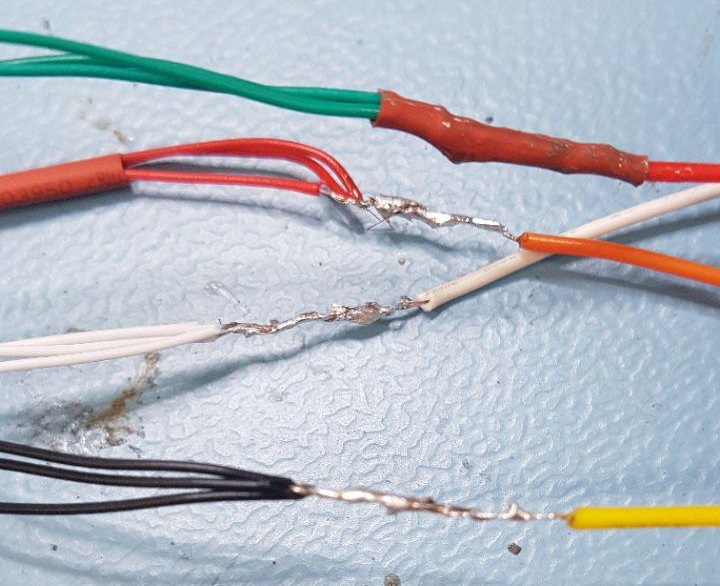
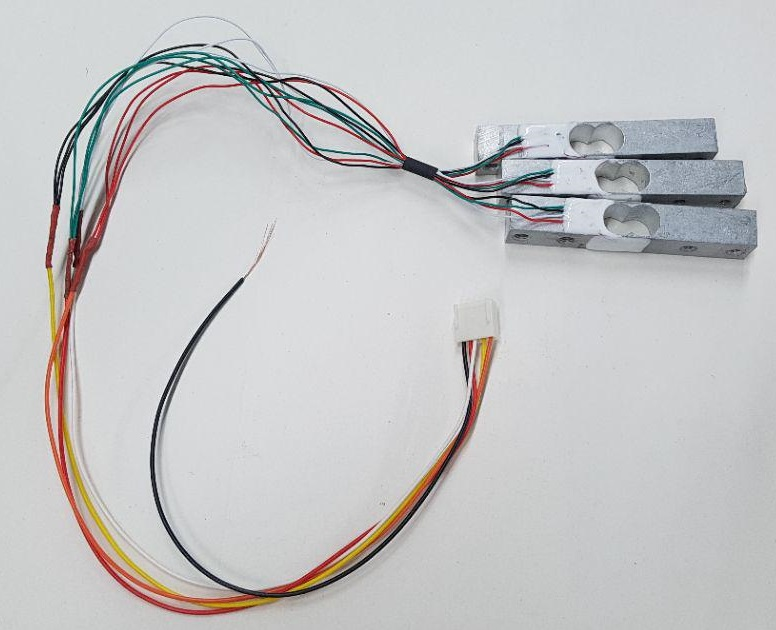
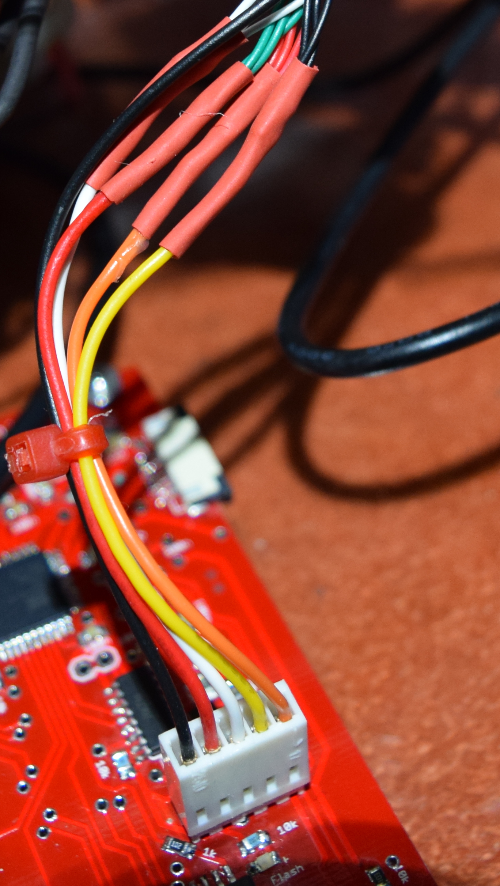
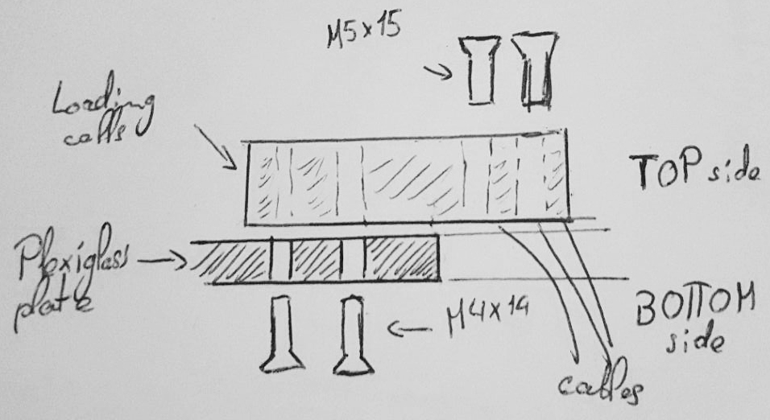
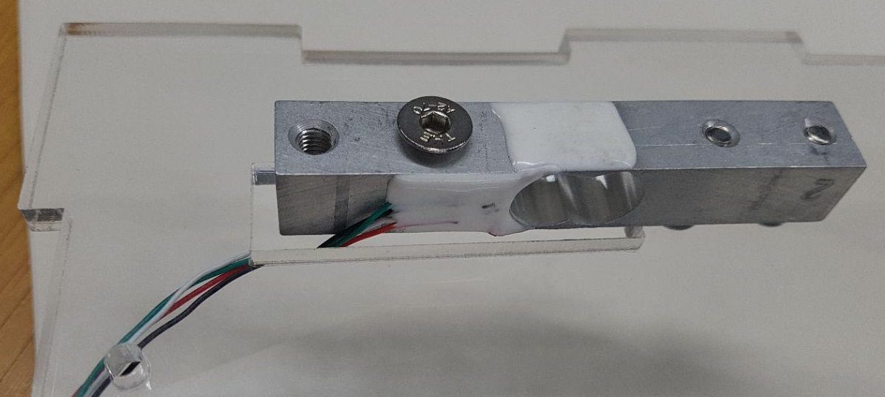
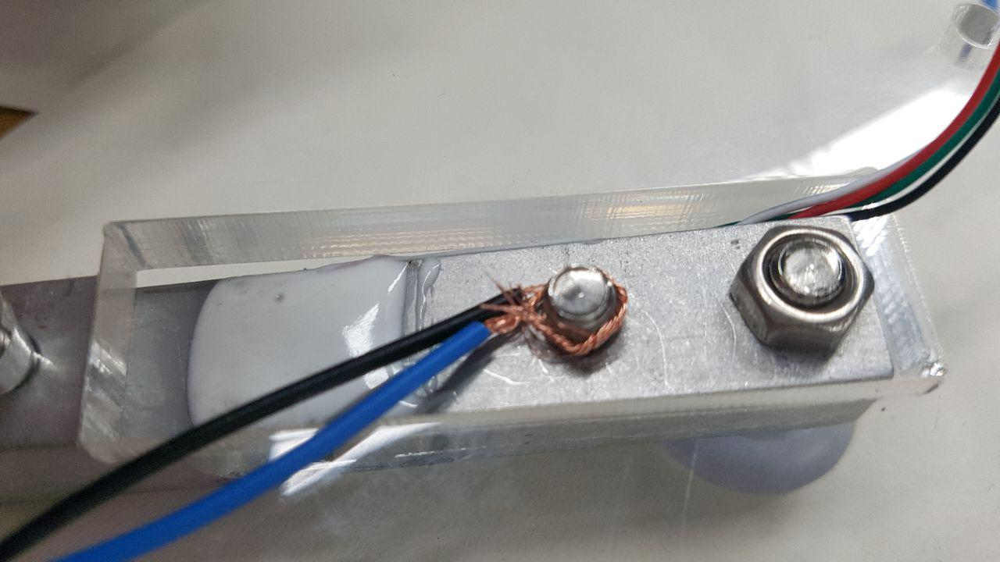
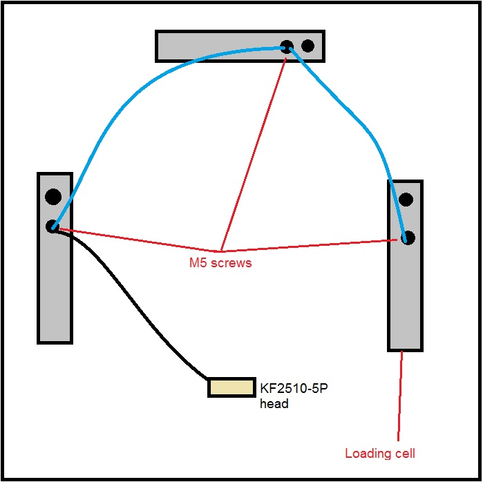
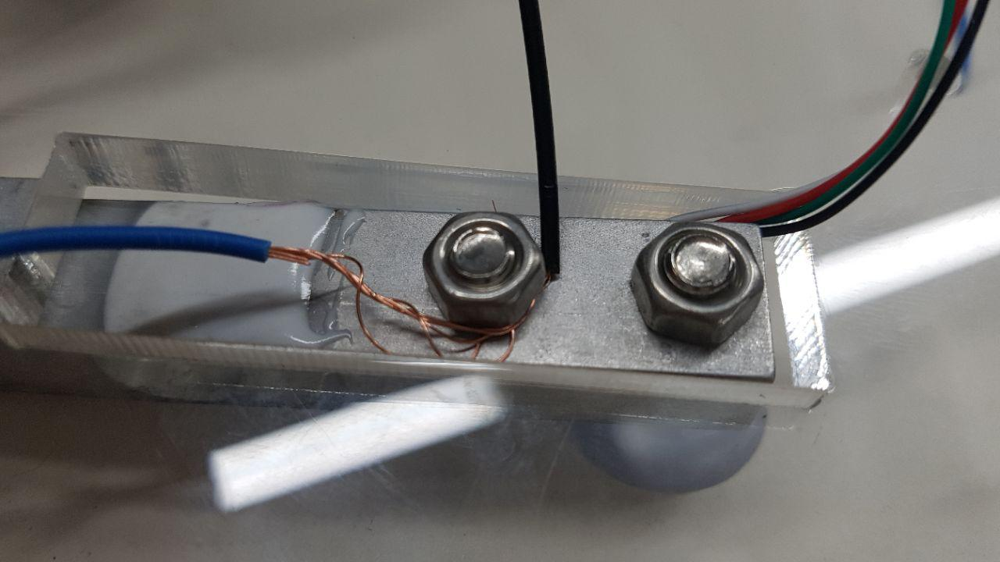
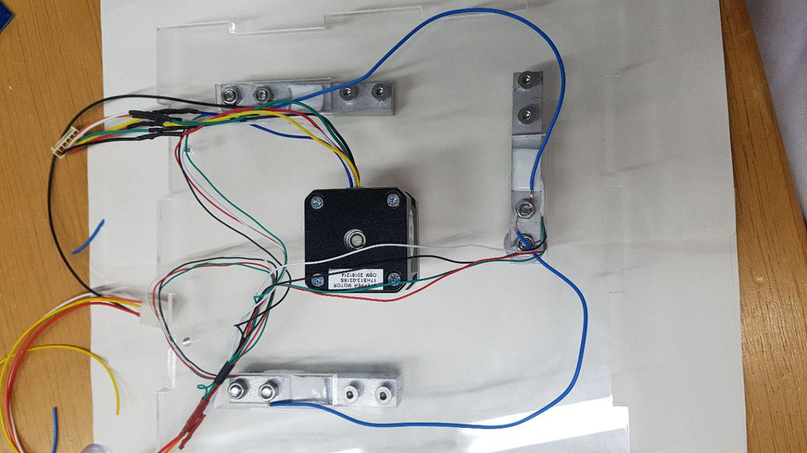

# Adding the loading cells (weight)

[Back to index](../../index.md)
[Previous section](../stepper)

---

The weight it determined using 3 loading cells connected in parallel.

Take three *loading cells* and one *cable 5 pins KF2510-5P*.

Solder the wires of the loading cells to the 5 pins cable as shown in the following picture. The length of the wires from the loading cells to the cable head should be approximately 20cm.

Do not solder the black cable from the *KF2510-5P*. Bare it for a couple of centimeters. You should now have all three loading cells attached to each other as follows:

Here is an example of how the loading cells cable looks like when connected to the main board (here a V4.4):

On the top part of the base, you will find three big rectangular holes each followed by two small circular ones. In each big hole, pass one loading cell from the bottom of the plate (the magnets from the stepper motor are on the top of the plate).

Screw each loading cell from below the plate with two *M4x14mm* screws (through the small holes), and on the extremity of the loading cell located above the hole, insert two *M5x14* screws.

The following drawing sums this up:

It should now look like this (one screw still missing on the picture):

Insert a *plastic screw cover* on the outest *M5* screw of each loading cell.

You will now need to connect all loading cells to each other. To do so, cut *two pieces of wire* of a length of approximately 20cm each and bare both of their ends. Connect the two loading cells on the sides to the central loading cell by wrapping the end of the wires around the central *M5* screw as shown below. In a similar way, connect the remaining black wire from the *KF2510-5P* to one of the loading cells on the sides.

*The following drawing shows how the loading cells should be connected to each other:*

Add a bolt on the end of each *M5* screw to tighten the connexions and keep the cables in place.

This final step completes the assembly of the loading cells. The top part of your bioreactors base should now look like this:

[Next section](../pid)